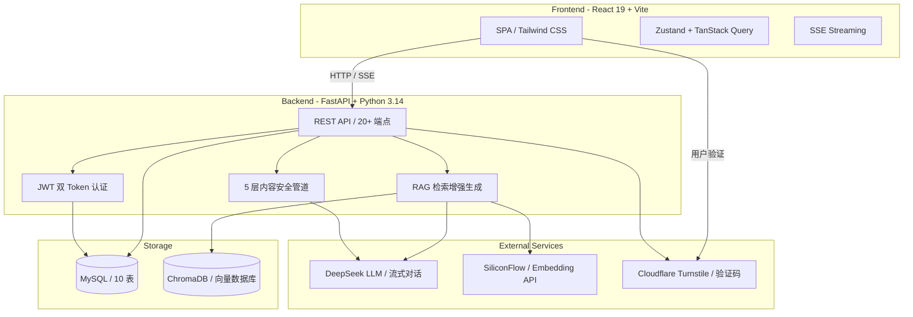

# AI答研所

> **AI 给出答案，人来判断对错** — 一个 AI 问答与社区验证平台

用户与 AI 对话，将优质回答发布为帖子，社区通过评论、点赞、收藏来讨论和验证 AI 答案的质量。

---

## 架构总览



### 核心流程

```
用户提问 → JWT 鉴权 → (可选 RAG 检索 ChromaDB) → 注入 context → 
DeepSeek 流式回复 → SSE 推送 → 前端逐字渲染 → 引用来源标注
```


## 截图

**广场页面**


**个人首页**


**AI 对话页面**


---

## 功能概览

| 功能 | 说明 |
|------|------|
| 🤖 **AI 对话** | 流式 SSE 输出，支持深度思考过程展示 |
| 💬 **对话管理** | 新建/重命名/删除/保存对话，侧边栏列表 |
| 📢 **分享帖子** | AI 自动生成标题+摘要，发布到广场供讨论 |
| 🏛️ **公共广场** | 帖子卡片列表 + 分类筛选 + Markdown 详情页 |
| 💛 **互动系统** | 点赞/评论/回复/收藏，实时计数 |
| 🔔 **通知系统** | 评论/回复/点赞/收藏/系统通知，已读未读管理 |
| 🔍 **RAG 知识库** | ChromaDB 向量检索，AI 回答引用社区帖子（余弦距离阈值 0.6） |
| 👤 **个人主页** | 我的帖子、收藏、编辑资料 |
| 🛡️ **防滥用系统** | 5 层内容过滤 + 举报自动隐藏 + 封禁/禁言 |
| 🔐 **管理员后台** | 统计面板、举报处理、用户管理、敏感词管理 |
| 📱 **响应式** | Tailwind CSS 适配桌面和移动端 |

---

## 技术栈

| 层级 | 技术 | 用途 |
|------|------|------|
| 前端框架 | React 19 + Vite 8 | SPA 应用 |
| 样式 | Tailwind CSS 3 | Utility-first 响应式 UI |
| 状态管理 | Zustand + TanStack Query v5 | 客户端/服务端状态分层 |
| HTTP 客户端 | Axios + 拦截器 | 自动 JWT 刷新队列 |
| 后端框架 | FastAPI + Python 3.14 | 异步 REST API |
| ORM | SQLAlchemy 2.0 + MySQL | 10 张表关系映射 |
| 认证 | JWT (access + refresh) + bcrypt | 无状态双 Token 续期 |
| LLM | DeepSeek API (deepseek-v4-flash) | 流式 AI 对话 + 内容审核 |
| Embedding | BAAI/bge-large-zh-v1.5 (SiliconFlow) | 文本→1024 维向量 |
| 向量库 | ChromaDB (PersistentClient) | 余弦相似度检索，距离阈值 0.6 |
| 流式 | Server-Sent Events | AI 回答逐 token 推送 |
| 限流 | slowapi | 梯度 API 频率控制 |
| 验证码 | Cloudflare Turnstile | 隐私友好的人机验证 |

---

## 快速启动

### 前置条件

- Python 3.12+
- Node.js 18+
- MySQL 8.0+

### 1. 数据库

```sql
CREATE DATABASE ai_dayansuo CHARACTER SET utf8mb4 COLLATE utf8mb4_unicode_ci;
```

### 2. 后端

```bash
cd backend
cp .env.example .env       # 编辑 .env 填入你的 API Key
pip install -r requirements.txt
python scripts/create_admin.py <用户名> <密码>   # 创建管理员
python -m uvicorn app.main:app --port 8000
```

**环境变量说明：**

| 变量 | 必填 | 说明 |
|------|------|------|
| `DATABASE_URL` | ✅ | MySQL 连接串 |
| `SECRET_KEY` | ✅ | JWT 签名密钥（`openssl rand -hex 32` 生成） |
| `DEEPSEEK_API_KEY` | ✅ | DeepSeek API Key |
| `DEEPSEEK_EMBEDDING_API_KEY` | ❌ | 默认复用 DEEPSEEK_API_KEY |

### 3. 前端

```bash
cd frontend
npm install
npm run dev       # http://localhost:5173
```

### 4. 重建向量索引（首次运行）

```bash
cd backend
python scripts/reindex_posts.py
```

启动后：
- 前端：`http://localhost:5173`
- API 文档：`http://localhost:8000/docs`

---

## 项目结构

```
ai_dayansuo/
├── backend/
│   ├── app/
│   │   ├── main.py                 # 应用入口
│   │   ├── core/                   # 配置、数据库、JWT、限流
│   │   ├── models/                 # ORM 模型（10 表）
│   │   ├── schemas/                # Pydantic 校验
│   │   ├── routes/                 # API 路由
│   │   └── services/
│   │       ├── ai_service.py       # DeepSeek 流式 + RAG 注入
│   │       ├── content_safety.py   # 5 层内容安全管道
│   │       ├── embedding_service.py# Embedding 向量化服务
│   │       ├── vector_store.py     # ChromaDB 封装（单例 + 损坏自愈）
│   │       └── summarizer.py       # AI 摘要生成
│   ├── requirements.txt
│   └── .env
├── frontend/
│   ├── src/
│   │   ├── pages/                  # 13 个页面
│   │   ├── components/             # 25+ 组件
│   │   ├── store/                  # Zustand 状态
│   │   └── api/                    # Axios + JWT 自动刷新
│   └── package.json
├── scripts/
│   ├── create_admin.py             # 管理员账户创建
│   └── reindex_posts.py            # ChromaDB 重建索引
├── docs/
│   └── database-schema.md          # 数据库表结构
└── README.md
```

---

## 关键技术点

### RAG 检索增强生成

用户提问时自动检索 ChromaDB 中相关社区帖子，注入 AI prompt 作为参考上下文：

1. 提问 → Embedding 向量化（BAAI/bge-large-zh-v1.5，1024 维）
2. ChromaDB 检索 top_k × 3 候选 → 余弦距离 < 0.6 过滤 → 取 top_k
3. XML `<context>` 格式注入 system prompt
4. AI 参考回答 + 末尾标注可点击的来源引用

**异常降级：** Embedding API 超时/报错时返回空列表，对话降级为纯 LLM 模式，不级联故障。

### JWT 双 Token + 自动刷新

- access_token（24h）+ refresh_token（7d）
- Axios 响应拦截器捕获 401 → 失败队列 → 单次 refresh → 重放全部排队请求
- 避免 N 个并发 401 触发 N 次 refresh 的竞态问题

### 5 层内容安全管道

```
空内容校验 → 敏感词匹配 → HTML 净化 → 重复检测 → AI 审核
```

前 3 层零/低成本拦截 ≥ 90% 违规内容，AI 审核只处理边界情况，节省 API 成本。

### SSE 流式事件类型

```
reasoning（思考过程）→ content（回答正文）→ citations（引用来源）→ done（结束）
```

---

## API 总览

### 认证
```
POST /api/auth/register    # 注册（需 Turnstile）
POST /api/auth/login       # 登录（失败 3 次后需 Turnstile）
POST /api/auth/refresh     # 刷新 Token
```

### 对话
```
GET    /api/conversations            # 已保存对话列表
POST   /api/conversations            # 新建对话
PATCH  /api/conversations/{id}       # 修改标题
DELETE /api/conversations/{id}       # 删除对话
GET    /api/conversations/{id}/messages   # 消息历史
POST   /api/conversations/{id}/messages   # 发送消息（SSE）
POST   /api/conversations/{id}/save       # 保存对话
```

### 帖子
```
GET    /api/posts                   # 广场列表
POST   /api/posts                   # 发帖（AI 自动生成标题/摘要）
GET    /api/posts/{id}              # 帖子详情
DELETE /api/posts/{id}              # 删帖（作者）
POST   /api/posts/{id}/like         # 点赞/取消
POST   /api/posts/{id}/bookmark      # 收藏/取消
```

### 管理后台（admin/moderator）
```
GET    /api/admin/stats             # 统计面板
GET    /api/admin/users             # 用户管理
PUT    /api/admin/users/{id}/status # 封禁/禁言/解封
GET    /api/admin/reports           # 举报列表
POST   /api/admin/reports/{id}/resolve  # 处理举报
```

完整 API 文档见 `http://localhost:8000/docs`（Swagger UI）。

---

## 数据库设计

10 张 MySQL 表 + ChromaDB 向量存储，详见 [docs/database-schema.md](docs/database-schema.md)。

| 表 | 说明 |
|-----|------|
| `users` | 用户 + 角色/封禁状态 |
| `conversations` | AI 对话会话 |
| `messages` | 问答消息 |
| `posts` | 帖子（含隐藏标记） |
| `comments` | 评论 + 回复 |
| `post_likes` | 点赞 |
| `post_bookmarks` | 收藏 |
| `notifications` | 通知 |
| `reports` | 举报 |
| `blocked_words` | 敏感词库 |

---

## 声明

**AI 出答案，人来定对错。** 这个产品的灵魂不是"又一个 AI 对话工具"，而是"AI 答案的检验场"。
